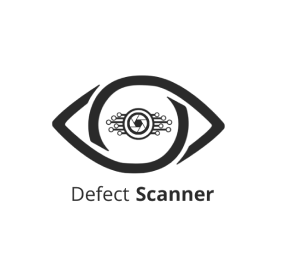

# AL_chennai
<div align="center">



# 🏭 AL Tower Assembly Inspection System

**Real-time AI-powered assembly line monitoring for Ashok Leyland tower components**

[](https://python.org)
[](https://github.com/ultralytics/ultralytics)
[](https://flask.palletsprojects.com)
[](https://developer.nvidia.com/cuda-toolkit)
[]()
[](LICENSE)

<br/>

*Detects • Sequences • Validates — all in real time*

</div>

---

## 📌 Overview

This system uses a **custom-trained YOLOv12x model** to monitor an Ashok Leyland tower assembly line via an RTSP camera feed. It automatically detects 16 assembly components, enforces the correct build sequence, flags out-of-order steps, and streams a live annotated video feed over HTTP — giving supervisors instant visibility into the assembly process.

---

## 🧠 Model Performance

> Trained on **NVIDIA A100 (40GB SXM4)** · **25 epochs** · **11,903 images** · **63,290 instances** · Image size: `640×640`

| Metric | Score |
|--------|-------|
| **mAP50** | **98.1%** |
| **mAP50-95** | **91.6%** |
| Precision | 97.9% |
| Recall | 95.2% |
| Inference speed | 8.7 ms/image |
| Training time | ~19.8 hours |

### Per-Class Performance

| Class | mAP50 | mAP50-95 |
|-------|-------|----------|
| end_cover | 99.5% | 99.1% |
| end_cover_bolt | 99.5% | 92.5% |
| tower | 99.5% | 99.4% |
| clamp | 99.5% | 99.3% |
| cutoff_valve | 99.5% | 99.4% |
| drain_plug | 99.4% | 91.1% |
| loctite | 99.5% | 95.0% |
| fixture | 99.5% | 99.4% |
| drillm | 99.5% | 97.2% |
| cover_plate | 99.5% | 97.6% |
| drill_bit1 | 99.5% | 95.4% |
| drill_bit2 | 99.4% | 96.7% |
| tower_movement | 99.3% | 85.6% |
| circlip_interlock | 99.5% | 80.3% |
| lock_pin_interlock | 85.3% | 69.8% |
| hammer | 87.4% | 67.9% |

---

## ✨ Features

| Feature | Description |
|---------|-------------|
| 🎯 **Object Detection** | 16-class custom YOLOv12x model running at GPU speed |
| 📋 **Step Sequencing** | Tracks 16 assembly steps and enforces correct order |
| 🚨 **Sequence Break Alert** | Instantly flags and highlights any out-of-order step |
| 📡 **Live MJPEG Stream** | Annotated feed accessible from any browser |
| 🔩 **Drill Position Detection** | Maps drill machine position to tightening step (end cover / drain plug / cut-off valve) |
| 🖐️ **Hand Zone Detection** | Detects gloved hand presence for spring and plunger fitment steps |
| 🎥 **Video Recording** | Toggle recording on/off via HTTP endpoint |
| ♻️ **Auto Cycle Reset** | Detects fixture placement and resets the cycle automatically |

---

## 🗂️ Project Structure

```
project/
├── models/
│   ├── yolov8n-pose.pt              # Pose estimation model (hand & drill tracking)
│   └── AL_tower_271225.pt           # Custom YOLOv12x assembly detection model
├── defect_scanner_logo.png          # Warmup / placeholder frame
├── defect-scanner-logo-transparent-cropped.png
├── dfyolo.yaml                      # YOLO dataset config
├── classes.txt                      # Class list
├── main.py                          # Main inference + streaming app
└── README.md
```

---

## 🏷️ Detection Classes

| ID | Class | Role |
|----|-------|------|
| 0 | `end_cover` | Assembly component |
| 1 | `end_cover_bolt` | Assembly component |
| 2 | `tower` | Main structure (presence gate) |
| 3 | `clamp` | Assembly component |
| 4 | `hammer` | Tool |
| 5 | `lock_pin_interlock` | Assembly component |
| 6 | `circlip_interlock` | Assembly component |
| 7 | `drain_plug` | Assembly component |
| 8 | `loctite` | Consumable |
| 9 | `cutoff_valve` | Assembly component |
| 10 | `tower_movement` | Motion indicator |
| 11 | `drill_bit1` | Tool |
| 12 | `drill_bit2` | Tool |
| 13 | `fixture` | Cycle reset trigger |
| 14 | `drillm` | Drill machine (positional tracking) |
| 15 | `cover_plate` | Assembly component |

---

## 📋 Assembly Sequence (16 Steps)

```
 1  End cover fitment
 2  End cover bolt fitment
 3  Clamping
 4  Interlock pin fitment
 5  Hammering interlock
 6  Circlip fitment
 7  Locking the circlip
 8  Drain plug fitment
 9  Apply Loctite
10  Cut-off valve fitment
11  End cover tightening
12  Drain plug tightening
13  Cut-off valve tightening
14  Detent plunger
15  Yellow spring
16  Pink spring
```

> The system confirms each step only after detecting the relevant class a minimum number of times in a rolling window — eliminating false positives from brief occlusions.

---

## 🚀 Installation

```bash
# 1. Clone the repository
git clone https://github.com/<your-username>/<repo-name>.git
cd <repo-name>

# 2. Install dependencies
pip install ultralytics opencv-python scikit-image av flask numpy

# 3. Place model weights in models/
#    models/yolov8n-pose.pt
#    models/AL_tower_271225.pt
```

---

## ⚙️ Configuration

Open `main.py` and update these before running:

**Camera / RTSP source** — inside `getF()`:
```python
video_path = "rtsp://user:password@<camera-ip>/stream1?tcp"
```

**Camera crop region** — adjust to your field of view:
```python
frame = frame[450:1500, 550:2000]  # [y1:y2, x1:x2]
```

**Detection thresholds:**
```python
tower_model.predict(frame, conf=0.4, iou=0.5, imgsz=640)
```

> ⚠️ Drill position pixel thresholds and hand zone boxes (`detent_box_pos`, `yellowS_box_pos`, `pinkS_box_pos`) are calibrated for a specific camera angle and zoom. Recalibrate these values whenever the camera is repositioned.

---

## ▶️ Running

```bash
python main.py
```

Flask starts on `http://0.0.0.0:5000`. The RTSP capture thread starts automatically in the background.

---

## 🌐 API Endpoints

| Endpoint | Method | Description |
|----------|--------|-------------|
| `/` | GET | Health check |
| `/live` | GET | Browser video stream page |
| `/video_feed` | GET | Raw MJPEG stream (use in ``) |
| `/clear` | GET | Reset current cycle and step tracking |
| `/record` | GET | Toggle video recording on / off |

---

## 🖥️ On-Screen Display

The annotated stream shows a step panel on the right side of the frame with real-time status:

| Indicator | Meaning |
|-----------|---------|
| 🟢 Green circle | Step completed in correct sequence |
| 🟡 Yellow circle | Step currently in progress |
| 🔴 Red circle + text | Step completed but sequence broken |
| ⬜ Blinking red block | The specific out-of-order step |
| Banner: `In Progress` | Cycle running normally |
| Banner: `Completed` | All steps done |
| Banner: `Sequence Break` | Wrong order detected — intervention needed |

---

## 🔬 Model Training

The model was trained on **Google Colab (A100 GPU)** using the YOLOv12x architecture.

**Training config:**
```python
from ultralytics import YOLO
model = YOLO('yolo12x.pt')
model.train(
    data='dfyolo.yaml',
    epochs=25,
    imgsz=640,
    batch=2,
    device=[0],
    close_mosaic=0
)
```

**Dataset config (`dfyolo.yaml`):**
```yaml
train: /content/train_dataset/train/images
val:   /content/train_dataset/valid/images
nc: 16
names: ['end_cover', 'end_cover_bolt', 'tower', 'clamp', 'hammer',
        'lock_pin_interlock', 'circlip_interlock', 'drain_plug', 'loctite',
        'cutoff_valve', 'tower_movement', 'drill_bit1', 'drill_bit2',
        'fixture', 'drillm', 'cover_plate']
```

---

## 📼 Video Recording

Call `/record` to start — files are saved as `.mp4` to:

```
C:/Users/admin/Videos/Recorded/<uuid>.mp4
```

Call `/record` again to stop. Update the output path in the `record()` function as needed.

---

## ⚠️ Known Limitations

- Drill and hand position detection is pixel-coordinate based — any camera adjustment requires recalibration of bounding box thresholds.
- Cycle history is not persisted across restarts.
- Video recording path is hardcoded for Windows.

---

## 🤝 Contributing

Pull requests are welcome. For major changes, please open an issue first to discuss what you'd like to change.

---

## 📄 License

[Apache](LICENSE)

---

<div align="center">
  <sub>Built for Ashok Leyland tower assembly line quality assurance</sub>
</div>